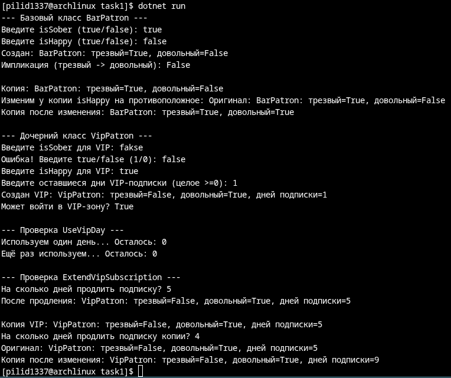
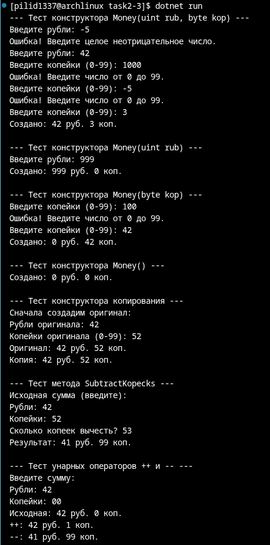
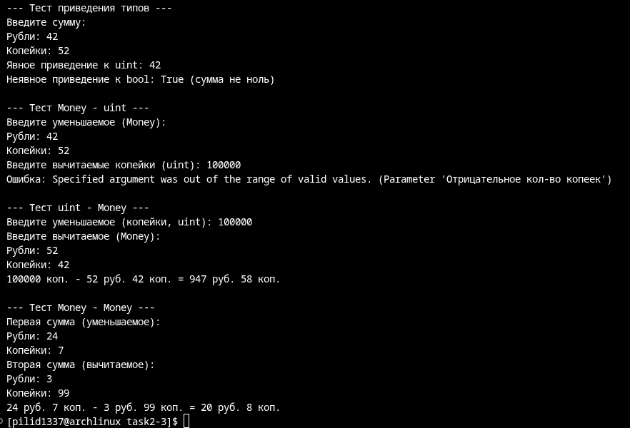

# Абдульманов Алмаз КМБ-1 Лабораторная №0

# Задание 1

## Задача 1

### Текст задачи

Разработать класс с двумя логическими полями. Создать конструктор копирования. Разработать метод, вычисляющий импликацию полей. Перегрузить метод ToString() для формирования строки из полей класса. Реализовать дочерний класс (его содержание предложить самостоятельно и описать в решении: какой содержательный смысл имеют поля; реализовать конструкторы; предложить и реализовать 2-3 метода). Протестировать все конструкторы и другие методы базового и дочернего классов

### Алгоритм решения

Класс - посетитель бара с полями "счастлив" и "трезв". Контруктор копирования создаёт новый объект с теми же значениями полей. Метод импликации работает как !_isSober || _isHappy. Метод ToString() перегружен с выводом в формате "BarPatron: трезвый={_isSober}, довольный={_isHappy}". Дочерний класс - вип-посетитель с доволнительным полем-счётчиком дней до конца подписки. Контрукторы наследуются с учётом поля _remainingVipDays. Реализованы 3 метода: проверка возможности войти в вип-зал (_remainingVipDays > 0), использование вип-дня (_remainingVipDays--) и продление подписки (_remainingVipDays += days).
### Тестирование

# Задание 2

## Задача 1

### Текст задачи

Money 
uint rubles, byte kopeks 
Вычитание копеек (uint) из объекта типа
Money(учесть, что денежная величина не
может быть меньше 0). Результат должен
быть типа Money.

### Алгоритм решения

У класса Money есть два поля: rubles (uint) и kopeks (byte). В методе вычитания копеек Money переводится полностью в копейки (1 рубль = 100 копеек), из этого вычитается заданное число копеек, которое переводится в рубли и копейки для нового объекта.

## Задача 2

### Текст задачи

Money Унарные операции:
-- вычитание копейки из объекта типа Money
++ добавление копейки к объекту типа Money
Операции приведения типа:
uint (явная) результатом является количество рублей (копейки
отбрасываются);
bool(неявная) результатом является true, если денежная сумма не равна 0.
Бинарные операции:
- Money m, беззнаковое целое число (лево- и правосторонние операции).
Число обозначает копейки
- Moneym1, Moneym2 вычитание денежных сумм

### Алгоритм решения

Унарные операции: 
    ++: переводим всю сумму в копейки, добваляем 1 и переводим в рубли и копейки для нового объекта
    --: вычитаем 1 копейку при помощи метода SubstractKopeks()
Операции приведения типа:
    Явная (uint): возвращаем кол-во рублей
    Неяваня (bool): проверяем кол-во копеек и рублей на 0: !(original._kopeks == 0 && original._rubles == 0)
Бинарные операции:
    -: переводим всю сумму/суммы в копейки, вычитаем и переводим в рубли и копейки для нового объекта

### Тестирование

